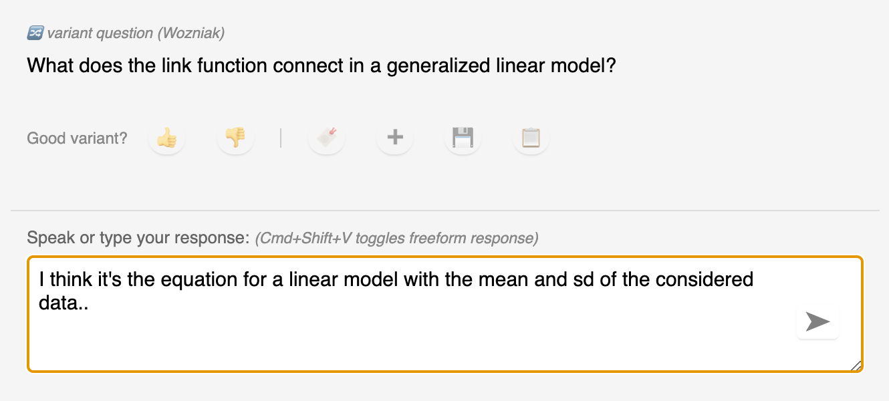
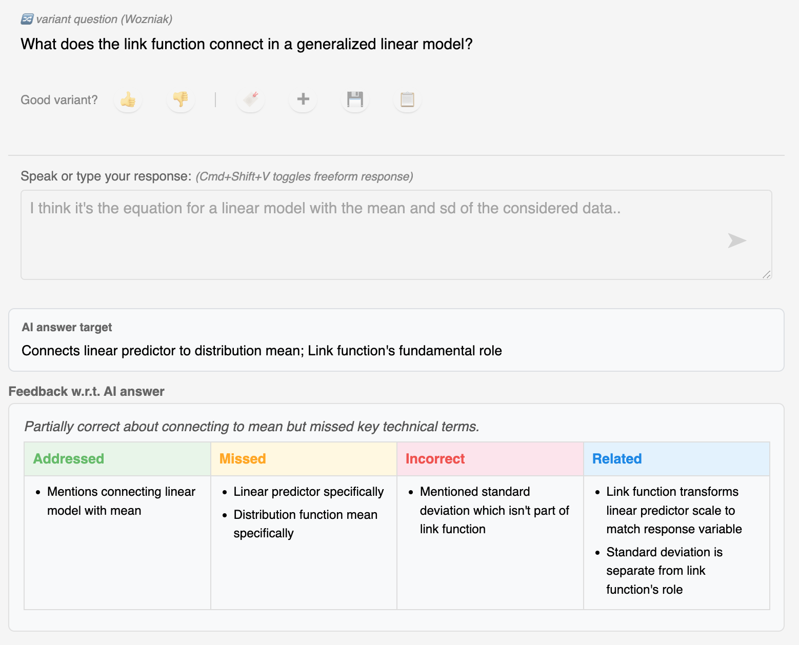
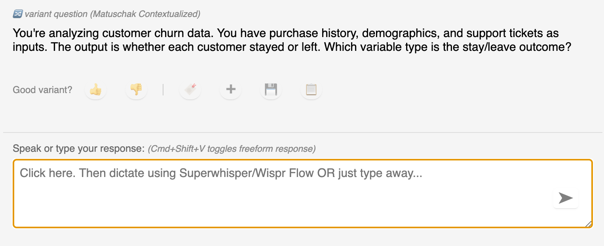
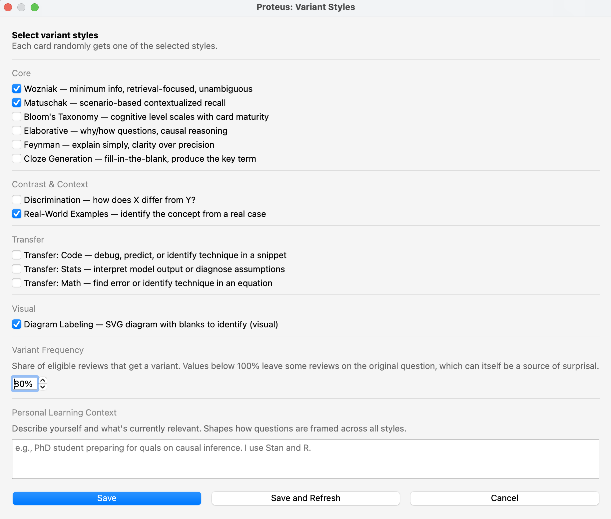

# Anki Proteus

An Anki add-on that rewrites each review question on the fly during test-time using an LLM, so you retrieve the concept rather than merely practice recognizing the card.

> **Requires an Anthropic API key** (Claude only — no OpenAI / Gemini support
> yet). Set it under **Tools → Add-ons → Anki Proteus → Config** after
> install. 

## Why?

Spaced repetition cards have a well-known, and honestly quite frustrating,
failure mode. After a bit of practice, a card can get memorized and retrieved
as a surface pattern between the wording of the prompt and the shape of the
answer, rather than as the concept it was meant to rehearse
[[Matuschak 2020](#references)]. You may answer the card correctly, the
scheduler extends the interval, but nothing flags that you happened to
participate in pattern recognition rather than knowledge retrieval.

Enter ***Anki Proteus***! It inserts a rephrasing step between the scheduler
and the display, so that at review time, the original question is reframed
into a variant that tests the same underlying concept in either different
wording, a different scenario, or a different type of recall task.

Which of those you get on a given review is itself randomly sampled from the
styles you've enabled, so the *kind* of question shifts unpredictably from one
visit to the next. This is another layer of surprisal, aimed at preventing
surface-level encoding at the style level as well.

The idea behind Proteus is that, at minimum, it forces you to parse the entire
question. Then you can proceed as usual and compare your retrieved answer with
the new answer to the reframed question.

Or, even better, there is a freeform response mode. You can think out loud,
using tools like [Wispr Flow](https://wisprflow.ai/) or
[Superwhisper](https://superwhisper.com/) to enter an answer to the variant
question, and you will receive an AI-generated score and feedback as an
additional signal for your self-grade.

There's also a personal learning context you can fill in: who you are, what
you're currently working on, what matters to you right now. Variants can be
framed against it. This is optional, of course! And changeable across sessions.
The idea is that personal relevance is one of the stronger drivers of encoding
and recall, and this allows for that. It can also help with goal-directed
learning and reframing in a given session.

The FSRS/SM-2 scheduler remains untouched. Only the original card is scheduled;
variants are cached for reuse and never become their own scheduled cards. Save
a favourite to promote it into a real card.

## How it works

When a card comes up for review, the add-on:

1. Sends the original question + answer to an LLM (e.g. via Anthropic API).
2. Receives a variant question that targets the same concept.
3. Displays the variant in place of the original question.
4. On flip, shows the AI-generated answer (in addition to the canonical card,
   if you wish). You reschedule the concept based on the quality of your
   retrieval.

Cards are pre-generated in the background, so the review UI is never blocked
waiting on the API. Variants are cached per card, so repeat reviews draw from
a pool rather than re-generating on every show.

## Two review modes

**Freeform mode (default)** — after the variant question, a text area appears.
Dictate or type your answer (for example, via
[Wispr Flow](https://wisprflow.ai/) or [Superwhisper](https://superwhisper.com/)),
submit, and the grading feedback fills in. The expected answer is pre-fetched
alongside the variant, so it appears instantly; the grading call runs in
parallel. Flip to see the canonical answer and the feedback panel.



After submitting, the grading panel appears inline with the expected answer
and a short critique of your response.



**Flip mode** — the standard Anki flow with a transformed question. Fast, with
no extra friction.

Toggle modes with **Ctrl+Shift+V** (Cmd+Shift+V on macOS) or in the config.

## Variant styles

Each eligible review picks a style at random from the configured set. Styles
are selected via **Tools → Proteus → Variant Styles…** and listed in
`config.json` under `variant_style`.

Each style's citation marks the intellectual lineage it draws from.

| Style                        | Best for                  | What it does                                                               | Grounding                |
| ---------------------------- | ------------------------- | -------------------------------------------------------------------------- | ------------------------ |
| **Wozniak**                  | Clean recall              | One concept, unambiguous wording, retrieval-focused.                       | [1]                      |
| **Matuschak Contextualized** | Understanding             | Embeds the concept in a 2-3 sentence scenario the learner reasons through. | [2]                      |
| **Bloom's Taxonomy**         | Maturing cards            | Cognitive level scales with card maturity (interval).                      | [3]                      |
| **Elaborative**              | Causal reasoning          | "Why" or "how" questions forcing explanation.                              | [4]                      |
| **Feynman**                  | Plain-language clarity    | "Explain simply" framing. Clarity over precision.                          | [5], [6]                 |
| **Cloze Generation**         | Key term recall           | Fill-in-the-blank producing the key term.                                  | [7], [8]                 |
| **Discrimination**           | Confusable concepts       | "How does X differ from Y?" with genuinely confusable ideas.                | [9], [10]                |
| **Real-World Examples**      | Transfer                  | Identify the concept from a real, named case.                              | Author's own framing.    |
| **Transfer: Code**           | Programming               | Debug, predict, or identify the technique in a code snippet.               | [11]                     |
| **Transfer: Stats**          | Statistics                | Interpret model output or diagnose assumptions.                            | [11]                     |
| **Transfer: Math**           | Math                      | Find the error or identify the technique in an equation.                   | [11]                     |
| **Diagram Labeling**         | Visual memory             | SVG diagram with labeled blanks (A, B, C) to identify.                     | [12]                     |

For example, the **Matuschak Contextualized** style on a stats card:



A good starting set is `wozniak`, `matuschak_contextualized`, `elaborative`,
`discrimination`, and `feynman`. Add transfer or diagram styles when they fit
your material. For exact length limits, Bloom's interval mapping, fallback
behavior, and source caveats, see [`docs/variant-styles.md`](docs/variant-styles.md).



## Features

- **Batch prefetching.** Variants and expected answers for upcoming cards are
  generated in parallel background threads at session start.
- **Variant caching.** A SQLite cache stores multiple variants per card, so
  repeat reviews draw from a pool rather than re-calling the API.
- **Configurable styles.** Twelve styles available; pick any subset.
- **Personal learner context.** Describe yourself and your current focus to
  shape how variants are framed.
- **Dual-perspective grading.** Freeform responses are evaluated against the
  AI expected answer (question page) and the canonical answer (answer page).
  Controlled by `feedback_mode`.
- **Pre-fetched expected answers.** The expected answer appears instantly on
  submit; grading fills in asynchronously.
- **Card ideas.** Save interesting variants via the bookmark button; review and
  convert to real cards from the Card Ideas dialog.
- **Quick save.** 💾 saves the variant Q+A as a new card. 📋 opens Add Note
  pre-filled. ➕ opens a blank Add Note.
- **Human-in-the-loop editing.** In the Card Ideas dialog, edit draft wording,
  apply reason tags, regenerate with targeted instructions.
- **Master toggle.** `Ctrl+Shift+P` turns Proteus on/off for the session.
- **Back to question.** `Ctrl+Shift+Left` returns to the question side from the
  answer side with state preserved.
- **Refresh variant cache.** Clear and regenerate all cached variants from the
  Proteus menu.
- **Usage budget.** Set a dollar cap to track API spend.

## Behaviour

Two stages: an **eligibility filter** (deterministic, card-level) and a
**random roll** (per review).

**Eligibility filter.** A card is only ever considered for a variant if all of
these pass:

- `enabled` is `true` and `api_key` is set.
- The note type is not in `exclude_note_types` (Image Occlusion is excluded
  by default, since there's no textual question to rephrase).
- The extracted question text is at least 10 characters. This skips
  image-only or media-only cards — if there aren't enough words to work with,
  the LLM has nothing to rephrase, so the original is shown as-is.
- The deck matches `active_decks` when that filter is configured (empty means
  all decks).
- The card's interval meets `min_interval_days`. Useful if you only want
  variants on mature cards (e.g., set to 7 or 14 so young cards stabilise on
  the original wording first).

**Random roll.** Among eligible cards, `transform_percent` decides how often
a variant actually shows. Default is **80**: ~80% of eligible reviews get a
variant, ~20% fall through to the original question. You can tune this from
the Variant Styles dialog based on how much novelty you're in the mood for —
lower it on days you want a gentler session, raise it to 100 for maximum
rephrasing. The skipped reviews are themselves a source of surprisal: not
knowing whether the next card will be rephrased keeps you from settling into
a fixed parsing stance.

Review-time replacement uses cached variants only. The UI is never blocked on
a synchronous API call.

For grading perspectives, coverage output, and the exact feedback schema, see
[`docs/grading.md`](docs/grading.md).

## Compatibility

Tested on Anki 25.02+ (Python 3.9, Qt 6). Uses `gui_hooks.card_will_show` with
context strings `reviewQuestion` and `reviewAnswer`.

## Installation

1. Find your Anki add-ons folder:
   - **Tools → Add-ons → Open Add-ons Folder** in Anki.
   - Or: `~/.local/share/Anki2/addons21/` (Linux),
     `~/Library/Application Support/Anki2/addons21/` (macOS),
     `%APPDATA%\Anki2\addons21\` (Windows).

2. Copy or symlink this repository into the add-ons folder as `anki_proteus`.

3. Restart Anki.

4. Configure your API key:
   - **Tools → Add-ons** → select *Proteus* → **Config**
   - Set `"api_key"` to your Anthropic API key.

   > **Security note on API-key storage.** Anki stores add-on config values
   > (including `api_key`) in plaintext inside its profile folder — typically
   > `~/Library/Application Support/Anki2/<profile>/addons21/<addon-id>/meta.json`
   > on macOS, or the equivalent path on Windows/Linux. That file is readable
   > by any process running as your user. Don't sync the profile folder to a
   > shared drive, don't commit a real key into `config.json`, and rotate the
   > key if you suspect the file was exposed.

## Configuration

Edit via **Tools → Add-ons → Config** or directly in `config.json`. The
defaults live in [`config.json`](config.json); the settings most worth knowing
about are:

**`variant_style`**: list of styles to sample from. Each card picks one at
random. Valid values: `wozniak`, `matuschak_contextualized`, `bloom`,
`elaborative`, `feynman`, `cloze_generation`, `discrimination`, `real_world`,
`transfer_code`, `transfer_stats`, `transfer_math`, `diagram_labeling`.

**`response_mode`**: `"freeform"` by default, or `"flip"` for the standard Anki
flow with transformed questions only.

**`learner_context`**: personal context injected into every variant prompt.
Describe yourself and what's currently relevant. Set via the Variant Styles
dialog.

**`feedback_mode`**: which grading perspectives to return. `"both"` (default),
`"ai"`, or `"canonical"`.

**`show_ai_coverage`**: show the AI coverage donut on the question side.
Default `false`.

**`active_decks`**: filter which decks get variants. Supports partial matching.
Empty means all decks.

**`transform_percent`**: below 100, some reviews show the original question.
80 means roughly 1 in 5 reviews is unmodified. Settable from the Variant
Styles dialog as well.

**`min_interval_days`**: only transform cards above this interval. Set to 7
or 14 to restrict to mature cards.

**`system_prompt`**: domain-specific context for variant quality.

**`grading_model`**: optional faster or cheaper model for grading only.

**`grading_max_tokens`**: max output tokens for grading. Default 280.

**`submit_delay_ms`**: short delay before submitting a freeform answer, useful
when dictation tools are still finalizing text.

**`debug_logging`**: write diagnostic logs to `proteus_diag.log`.

## Cost (assuming Claude Sonnet API calls)

- **Flip mode.** Roughly one API call per transformed review; caching reduces
  this.
- **Freeform mode.** Roughly one additional API call per review for grading.
- Text variant: ~\$0.003 each. Visual/transfer: ~\$0.006–0.010 each (more
  output tokens).
- Freeform grading: ~\$0.006 per call (`"ai"` or `"canonical"`), ~\$0.009 per
  call (`"both"`).
- At 50 reviews per day: roughly \$0.12–0.25/day in flip mode, \$0.30–0.50/day
  in freeform mode.

## Keyboard shortcuts and menu

- **Ctrl+Shift+P**: toggle Proteus on/off (Cmd+Shift+P on macOS).
- **Ctrl+Shift+V**: toggle flip/freeform mode (Cmd+Shift+V on macOS).
- **Ctrl+Shift+Left**: back to question from the answer side
  (Cmd+Shift+Left on macOS).
- **Enter** or the submit button (freeform): submit the response and start
  grading.
- The **Tools → Proteus** menu also exposes Card Ideas, Usage Stats, Variant
  Styles, Refresh Variant Cache, and the same session toggles.

## Documentation

- [`docs/variant-styles.md`](docs/variant-styles.md): exact style behavior,
  length limits, Bloom maturity mapping, fallbacks, and source caveats.
- [`docs/grading.md`](docs/grading.md): feedback modes, coverage output schema,
  grading semantics, and dictation timing.

## Development

Symlink the repo into your add-ons folder:

```bash
ln -s /path/to/anki-proteus ~/Library/Application\ Support/Anki2/addons21/anki_proteus
```

Changes take effect on Anki restart. Run tests:

```bash
pytest -v
```

## License

Anki Proteus is licensed under the GNU Affero General Public License v3.0 or
later. See `LICENSE`.

## Future directions

- **Port this to Obsidian**
- **Web search for discrimination**: fetch commonly confused concepts to
  build better contrasts.
- **Chrome extension**: generate cards from web page content using the same
  prompt engineering.
- **Visual styles**: error detection, flowchart completion, graph
  interpretation.
- **Keyword similarity**: client-side sanity check on LLM coverage verdicts.
- **Pretesting**: show variants before first review (productive failure).

## References

[1] Wozniak, P. (2000). *Effective learning: Twenty rules of formulating
knowledge.* SuperMemo. <https://super-memory.com/articles/20rules.htm>

[2] Matuschak, A. (2020). *How to write good prompts: using spaced repetition
to create understanding.* <https://andymatuschak.org/prompts/>

[3] Anderson, L. W., & Krathwohl, D. R. (Eds.). (2001). *A Taxonomy for
Learning, Teaching, and Assessing: A Revision of Bloom's Taxonomy of
Educational Objectives.* Longman.

[4] Dunlosky, J., Rawson, K. A., Marsh, E. J., Nathan, M. J., & Willingham,
D. T. (2013). Improving students' learning with effective learning techniques:
Promising directions from cognitive and educational psychology.
*Psychological Science in the Public Interest*, 14(1), 4–58.
<https://doi.org/10.1177/1529100612453266>

[5] Chi, M. T. H., Bassok, M., Lewis, M. W., Reimann, P., & Glaser, R. (1989).
Self-explanations: How students study and use examples in learning to solve
problems. *Cognitive Science*, 13(2), 145–182.
<https://doi.org/10.1207/s15516709cog1302_1>

[6] Fiorella, L., & Mayer, R. E. (2013). The relative benefits of learning by
teaching and learning by preparing to teach. *Contemporary Educational
Psychology*, 38(4), 281–288.
<https://doi.org/10.1016/j.cedpsych.2013.06.001>

[7] Slamecka, N. J., & Graf, P. (1978). The generation effect: Delineation of
a phenomenon. *Journal of Experimental Psychology: Human Learning and Memory*,
4(6), 592–604. <https://doi.org/10.1037/0278-7393.4.6.592>

[8] Bjork, R. A. (1994). Memory and metamemory considerations in the training
of human beings. In J. Metcalfe & A. P. Shimamura (Eds.), *Metacognition:
Knowing about knowing* (pp. 185–205). MIT Press.

[9] Rohrer, D., Dedrick, R. F., & Burgess, K. (2014). The benefit of
interleaved mathematics practice is not limited to superficially similar kinds
of problems. *Psychonomic Bulletin & Review*, 21(5), 1323–1330.
<https://doi.org/10.3758/s13423-014-0588-3>

[10] Kornell, N., & Bjork, R. A. (2008). Learning concepts and categories:
Is spacing the "enemy of induction"? *Psychological Science*, 19(6), 585–592.
<https://doi.org/10.1111/j.1467-9280.2008.02127.x>

[11] Morris, C. D., Bransford, J. D., & Franks, J. J. (1977). Levels of
processing versus transfer appropriate processing. *Journal of Verbal
Learning and Verbal Behavior*, 16(5), 519–533.
<https://doi.org/10.1016/S0022-5371(77)80016-9>

[12] Clark, J. M., & Paivio, A. (1991). Dual coding theory and education.
*Educational Psychology Review*, 3(3), 149–210.
<https://doi.org/10.1007/BF01320076>
